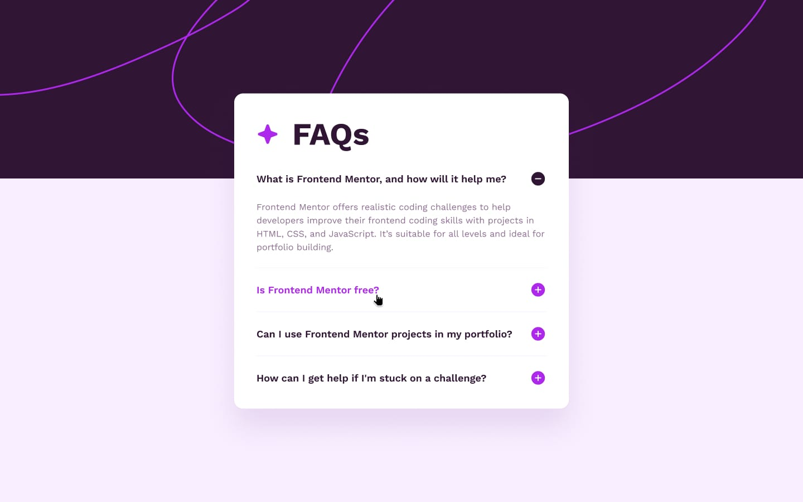

# Frontend Mentor - FAQ accordion solution

This is a solution to the [FAQ accordion challenge on Frontend Mentor](https://www.frontendmentor.io/challenges/faq-accordion-wyfFdeBwBz). Frontend Mentor challenges help you improve your coding skills by building realistic projects.

## Table of contents

- [Overview](#overview)
  - [The challenge](#the-challenge)
  - [Screenshot](#screenshot)
  - [Links](#links)
- [My process](#my-process)
  - [Built with](#built-with)
  - [Useful resources](#useful-resources)
- [Author](#author)

## Overview

### The challenge

Users should be able to:

- Hide/Show the answer to a question when the question is clicked
- Navigate the questions and hide/show answers using keyboard navigation alone
- View the optimal layout for the interface depending on their device's screen size
- See hover and focus states for all interactive elements on the page

### Screenshot - Desktop View

### Screenshot - Active State

### Screenshot - Mobile View

### Links

- Solution URL: [GitHub](https://github.com/divyapatel01/recipe-page)
- Live Site URL: [Demo](https://codewithd-faq-accordion.netlify.app)

## My process

### Built with

- Semantic HTML5 markup
- CSS custom properties
- Flexbox
- CSS variables
- Mobile-first workflow
- Javascript

### Useful resources

- [PixelParallel by htmlBurger](https://chrome.google.com/webstore/detail/pixelparallel-by-htmlburg/iffnoibnepbcloaaagchjonfplimpkob) - PixelParallel is a completely free, super handy and light HTML vs Design comparison tool for front-end developers that will help you code pixel perfect websites with ease.
  Built from developers to developers, PixelParallel is a tool working in favor of the ultimate precision in front-end coding.

## Author

- Website - [Divya Patel](https://github.com/divyapatel01)
- Frontend Mentor - [@divyapatel01](https://www.frontendmentor.io/profile/divyapatel01)
- Twitter - [@divyapatel0106](https://www.twitter.com/divyapatel0106)
- LinkedIn - [Divya Patel](https://www.linkedin.com/in/divya-patel-june01/)
